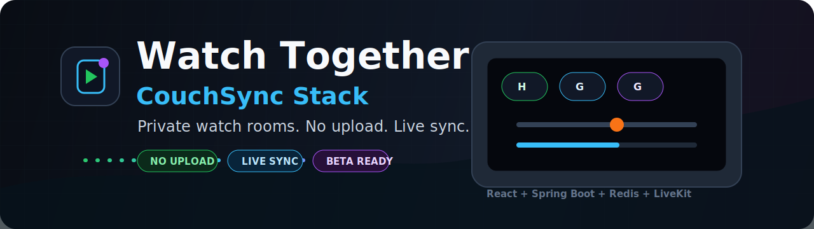

<p align="center">
  
</p>

<h1 align="center">Watch Together</h1>

<p align="center">
  <strong>CouchSync Stack</strong> — приватные watch rooms для локальных фильмов. Файл остаётся у host; гости получают синхронный просмотр, чат, voice и reconnect через LiveKit-backed media plane.
</p>

<p align="center">
  <a href="docs/WT-608_PRODUCT_REVIEW_REFRESH.md"></a>
  <a href="docs/WT-004_MEDIA_PIPELINE_ADR.md"></a>
  <a href="docs/WT-106_CONTRACTS.md"></a>
  <a href=".github/workflows/quality-gate.yml"></a>
</p>

## Repository Card

**GitHub About:** CouchSync: private co-watch rooms for local movies — no uploads, just shared playback.

**Topics:** `watch-party`, `co-watch`, `couchsync`, `webrtc`, `livekit`, `synchronized-playback`, `local-media`, `private-rooms`, `spring-boot`, `react`, `redis`, `websocket`, `closed-beta`.

## Что это

Watch Together — MVP для приватного синхронного просмотра. Host выбирает локальный видеофайл, создаёт приватную комнату и приглашает гостей одной ссылкой. Приложение не является видеохостингом: байты фильма остаются на машине host.

## Текущий статус

P0 технически подтверждён.

- WT-001 доказал путь: локальный MP4 -> `captureStream()` -> LiveKit -> guest.
- WT-002 зафиксировал границы браузеров и кодеков.
- WT-003 зафиксировал первый baseline качества и задержки.
- WT-004 принял решение по media pipeline и добавил первый data-channel прототип `playback-state`.
- WT-101 создал monorepo-структуру.
- WT-102 добавил Spring Boot backend skeleton.
- WT-103 добавил React frontend foundation.
- WT-104 добавил запускаемый Docker Compose stack.
- WT-105 добавил CI quality gate, test reports и dependency security scan.
- WT-106 зафиксировал REST, WebSocket и error contracts.
- WT-201 реализовал создание приватной комнаты с Redis TTL и idempotency.
- WT-202 реализовал вход гостя, session identity и ограничение вместимости комнаты.
- WT-203 реализовал авторизованный room WebSocket и snapshot при connect/reconnect.
- WT-204 реализовал backend-owned presence heartbeat и online/offline fan-out.
- WT-205 реализовал host close, `room.closed` и cleanup room lifecycle.
- WT-206 реализовал явный выход guest participant, `participant.left` и освобождение места в комнате.
- WT-207 реализовал `participant.joined` для активных WebSocket-сессий комнаты.
- WT-208 подключил frontend к create/join flow и backend room WebSocket events.
- WT-209 реализовал восстановление room session после refresh через `GET /api/v1/rooms/{roomId}`.
- WT-301 добавляет выдачу LiveKit product tokens через backend room/access модель.
- WT-302 подключает product frontend к LiveKit room через backend-issued token.
- WT-303 добавляет диагностику локального видеофайла host-а: проверку формата, `captureStream` и metadata перед публикацией.
- WT-304 публикует выбранный локальный файл host-а в LiveKit и добавляет stop/cleanup публикации.
- WT-305 добавляет guest playback remote video/audio tracks из LiveKit.
- WT-306 добавляет синхронизацию host playback state через LiveKit data channel.
- WT-401 добавляет управление воспроизведением для host: play/pause/seek, rollback при ошибке.
- WT-402 добавляет reconnect host: `HOST_DISCONNECTED`, grace period, восстановление роли и закрытие комнаты по таймауту.
- WT-403 добавляет текстовый чат комнаты: лимит длины, серверный rate limit, XSS-защита, системные сообщения, эфемерная история.
- WT-404 добавляет voice chat: явное включение микрофона, mute/unmute, отдельные microphone tracks и cleanup при disconnect.
- WT-405 добавляет privacy-safe индикаторы качества LiveKit: upload/download bitrate, packet loss, jitter, RTT и warning states.
- WT-406 добавляет frontend auto-reconnect room WebSocket, восстановление host-публикации после LiveKit reconnect и Error UX с recovery-действиями.
- WT-501 усиливает backend test suite: аудит покрытия по 7 областям и закрытие WebSocket-пробелов (duplicate/stale connection, identity mismatch).
- WT-502 усиливает frontend test suite вокруг player state, cleanup, errors/reconnect, permissions и API contracts.
- WT-503 добавляет multi-user E2E (Playwright): host + 2 гостя, presence и chat через реальный стек; отдельный `test:e2e` вне `check:ci`.
- WT-504 добавляет network resilience E2E/runbook: browser offline -> room WebSocket reconnect -> chat recovery, плюс manual matrix для latency/loss/TURN/VPN.
- WT-505 усиливает безопасность: аудит модели угроз, CSP и security-заголовки на gateway, secret-scanning (gitleaks) в CI.
- WT-506 добавляет observability: Micrometer room-метрики (WS/lifecycle/host/chat) через actuator/prometheus, privacy-safe.
- WT-507 подтверждает MVP capacity: host + 1/2/3 guest в Playwright, отказ 5-го участника и runbook CPU/RAM/network с safe limits.
- WT-508 готовит закрытую beta deployment основу: TLS/secret/backup/monitoring/rollback runbook, post-deploy smoke, ограничения и privacy/terms draft.
- WT-601 добавляет beta feedback: endpoint с correlation receipt, privacy-safe metadata, frontend-форму и smoke-проверку.
- WT-602 фиксирует product review: решение CONTINUE для ограниченной invite-only beta и список follow-up задач перед расширением.
- WT-603 добавляет beta evidence run kit: preflight-скрипт и шаблон отчёта для Chrome/Edge, host+1/host+3, TURN/UDP и blocker triage.
- WT-604 добавляет client telemetry: privacy-safe endpoint и frontend-события (first frame, publish/playback error, quality) для агрегированной Successful Watch Session Rate поверх WT-506 метрик.
- WT-605 добавляет feedback operations: Redis TTL storage, operator export, triage поля и runbook регулярного просмотра beta feedback.
- WT-606 усиливает безопасность беты: Redis-backed rate limits на create/join/token/feedback/telemetry (429 + Retry-After), env-управляемый CSP connect-src, HSTS и actuator за Spring Security.
- WT-607 добавляет media QoS/cost benchmark kit: JSON-шаблон, summary script, traffic/cost thresholds и scaling gates для host + 1/2/3 guest.
- WT-608 повторяет product review после закрытия P7: обновлённый evidence snapshot, статус beta-гейтов и решение CONTINUE к фактическому прогону invite-only beta (реальные user/QoS данные — за внешним прогоном).
- WT-609 добавляет operator dashboard: `/operator` UI для просмотра feedback reports, фильтров, деталей, export и triage actions поверх WT-605 endpoints.
- WT-619 формализует browser-native поддержку локальных MP4/M4V и WebM: явный file picker policy, runtime diagnostics и честные границы codec support без загрузки файла на backend.
- WT-621 делает LAN-проверку комнаты понятнее: читаемые события, честная HTTPS-граница голоса и предупреждение для `localhost` invite.

P1 foundation, P2 room lifecycle, P3 media integration, P4 host UX, P5 stabilization и P6 closed beta readiness завершены repo-side. P7 beta iteration закрыт repo-side: WT-603 готовит evidence-прогон, WT-604 закрыл телеметрию для метрики успешности сессии, WT-605 добавил управляемый feedback triage, WT-606 — security/rate-limit hardening, WT-607 — media QoS/cost benchmark kit. WT-608/WT-609 (P8) закрывают repo-side evidence refresh и operator feedback UI; P9 начинается с предсказуемой media compatibility policy. Оставшийся гейт расширения beta — реальный staging-прогон.

## Как читать репозиторий

- Если нужно быстро запустить проект, начните с раздела [Корневые команды](#корневые-команды).
- Если нужно понять архитектуру и принятые решения, начните с [docs/README.md](docs/README.md).
- Если нужно проверить API-границы, смотрите [contracts/README.md](contracts/README.md).
- Если нужно поднять локальную среду, смотрите [infra/README.md](infra/README.md).

## Структура репозитория

```text
backend/                    Spring Boot бэкенд.
contracts/                  OpenAPI, JSON Schema и примеры контрактов.
frontend/                   React-фронтенд.
infra/                      Локальная Docker Compose среда.
docs/                       Карта проекта, ADR, планы и отчёты по тикетам.
poc/media-capture-livekit/  P0 proof of concept для media pipeline.
```

## Корневые команды

Установить зависимости из корня репозитория:

```bash
pnpm install
```

Запустить все текущие проверки:

```bash
pnpm contracts:check
pnpm test
pnpm build
pnpm check
```

Запустить CI-вариант с машинными отчётами тестов и аудитом production npm dependencies:

```bash
pnpm check:ci
pnpm security:audit
```

Запустить backend-проверки отдельно:

```bash
pnpm backend:test
pnpm backend:build
```

Запустить backend локально:

```bash
pnpm backend:bootRun
```

Запустить frontend локально:

```bash
pnpm dev:frontend
```

Собрать и запустить весь локальный stack:

```bash
pnpm infra:up
pnpm infra:check
```

Приложение будет доступно на `http://127.0.0.1:8088`.

Остановить локальный stack:

```bash
pnpm infra:down
```

Запустить P0 media PoC из корня:

```bash
pnpm dev:poc
```

Остановить PoC LiveKit container:

```bash
pnpm dev:poc:down
```

## Документация

Основная карта документации находится в [docs/README.md](docs/README.md). Она показывает порядок чтения документов и объясняет, какие файлы являются историей PoC, foundation и P2 room lifecycle.

Media PoC остаётся референсной реализацией в [poc/media-capture-livekit](poc/media-capture-livekit/README.md).

- [WT-002 матрица совместимости](docs/WT-002_COMPATIBILITY_MATRIX.md)
- [WT-003 качество и задержка](docs/WT-003_QUALITY_LATENCY.md)
- [WT-004 media pipeline ADR](docs/WT-004_MEDIA_PIPELINE_ADR.md)
- [WT-004 product-state прототип](docs/WT-004_PRODUCT_STATE.md)
- [WT-102 backend skeleton](docs/WT-102_BACKEND_SKELETON.md)
- [WT-103 React frontend](docs/WT-103_REACT_FRONTEND.md)
- [WT-104 локальная инфраструктура](docs/WT-104_LOCAL_INFRASTRUCTURE.md)
- [WT-105 CI quality gate](docs/WT-105_CI_QUALITY_GATE.md)
- [WT-106 контракты](docs/WT-106_CONTRACTS.md)
- [WT-201 создание комнаты](docs/WT-201_CREATE_ROOM.md)
- [WT-202 вход гостя](docs/WT-202_GUEST_JOIN.md)
- [WT-203 WebSocket и snapshot](docs/WT-203_WEBSOCKET_SNAPSHOT.md)
- [WT-204 presence heartbeat](docs/WT-204_PRESENCE_HEARTBEAT.md)
- [WT-205 room close и expiry](docs/WT-205_ROOM_CLOSE_EXPIRY.md)
- [WT-206 participant leave](docs/WT-206_PARTICIPANT_LEAVE.md)
- [WT-207 participant joined](docs/WT-207_PARTICIPANT_JOINED.md)
- [WT-208 frontend room events](docs/WT-208_FRONTEND_ROOM_EVENTS.md)
- [WT-209 room snapshot restore](docs/WT-209_ROOM_SNAPSHOT_RESTORE.md)
- [WT-301 LiveKit product tokens](docs/WT-301_LIVEKIT_PRODUCT_TOKENS.md)
- [WT-302 LiveKit client connection](docs/WT-302_LIVEKIT_CLIENT_CONNECTION.md)
- [WT-303 file diagnostics](docs/WT-303_FILE_DIAGNOSTICS.md)
- [WT-304 публикация локального файла в LiveKit](docs/WT-304_LIVEKIT_FILE_PUBLISH.md)
- [WT-305 просмотр LiveKit-потока гостем](docs/WT-305_GUEST_LIVEKIT_PLAYBACK.md)
- [WT-306 синхронизация playback state](docs/WT-306_PLAYBACK_STATE_SYNC.md)
- [WT-401 host controls](docs/WT-401_HOST_CONTROLS.md)
- [WT-402 host reconnect](docs/WT-402_HOST_RECONNECT.md)
- [WT-403 текстовый чат](docs/WT-403_TEXT_CHAT.md)
- [WT-404 voice chat](docs/WT-404_VOICE_CHAT.md)
- [WT-405 quality indicators](docs/WT-405_QUALITY_INDICATORS.md)
- [WT-406 frontend reconnect и Error UX](docs/WT-406_FRONTEND_WEBSOCKET_RECONNECT.md)
- [WT-501 backend tests](docs/WT-501_BACKEND_TESTS.md)
- [WT-502 frontend tests](docs/WT-502_FRONTEND_TESTS.md)
- [WT-503 multi-user E2E](docs/WT-503_MULTI_USER_E2E.md)
- [WT-504 network resilience](docs/WT-504_NETWORK_RESILIENCE.md)
- [WT-505 security hardening](docs/WT-505_SECURITY_HARDENING.md)
- [WT-506 observability](docs/WT-506_OBSERVABILITY.md)
- [WT-507 capacity test](docs/WT-507_CAPACITY_TEST.md)
- [WT-508 beta deployment](docs/WT-508_BETA_DEPLOYMENT.md)
- [WT-601 beta feedback](docs/WT-601_FEEDBACK.md)
- [WT-602 product review](docs/WT-602_PRODUCT_REVIEW.md)
- [WT-603 beta evidence run](docs/WT-603_BETA_EVIDENCE_RUN.md)
- [WT-604 client telemetry](docs/WT-604_CLIENT_TELEMETRY.md)
- [WT-605 feedback operations](docs/WT-605_FEEDBACK_OPERATIONS.md)
- [WT-606 beta security hardening](docs/WT-606_BETA_SECURITY_HARDENING.md)
- [WT-607 media QoS/cost benchmark](docs/WT-607_MEDIA_QOS_COST_BENCHMARK.md)
- [WT-608 product review refresh](docs/WT-608_PRODUCT_REVIEW_REFRESH.md)
- [WT-609 operator dashboard](docs/WT-609_OPERATOR_DASHBOARD.md)
- [WT-619 native media capability foundation](docs/WT-619_NATIVE_MEDIA_CAPABILITY_FOUNDATION.md)
- [WT-621 LAN room usability](docs/WT-621_LAN_ROOM_USABILITY.md)
- [Definition of Done](docs/DEFINITION_OF_DONE.md)

## Правила foundation

- Не загружать байты фильма в backend services.
- LiveKit остаётся media plane.
- Spring Boot отвечает за rooms, roles, access, state, tokens, presence, TTL, audit и telemetry.
- PoC остаётся reference implementation; product token flow реализуется через backend room/access contracts.
- Секреты хранить только в локальных `.env` файлах или secret storage. В git попадают только examples, а не реальные значения.
